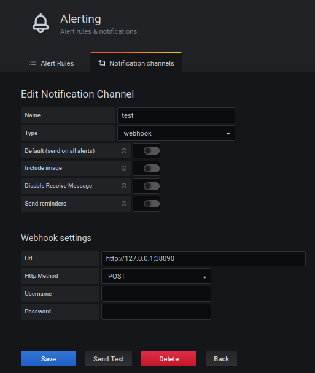
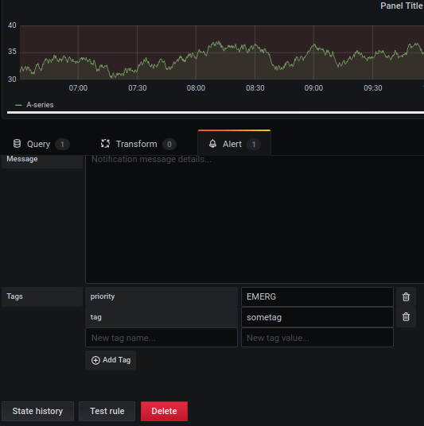

# Grafana Alert to Syslog


Listens to Grafana's webhooks and sends them to syslog server

## configuration (flags)

**dest** -  syslog server hostname (default "127.0.0.1:514")

**protocol** - protocol for syslog: tcp\udp (default "tcp")

**port** - port for this webserver (default ":38090")

**format** - syslog formats: RFC3164/RFC5424/DEFUALT (default "RFC3164")

for example sending to syslog server which listens in ```udp``` at ```10.0.0.4:514``` in ```RFC5424``` format execute:
```bash
./grafana-alert-to-syslog -dest 10.0.0.4:514 -protocol udp -format RFC5424
```

## configure webhook in grafana
- navigate to ```Notification Channels```
- click ```new channel```
- choose "webhook" on ```type``` dropdown
- under ```Webhook settings``` set url with the port you configured via flag (defaults to 38090)
- leave ```Http Method``` as POST

it should look like:


## setting priority and tag for alerts
To set the priorities/tags for the different alerts:
- navigate to the alert and add tags named: "priority" and/or "tag" and set the value...
- priority accepts the following:
    - EMERG
    - ALERT
    - CRIT
    - ERR
    - WARNING
    - NOTICE
    - INFO
    - DEBUG
